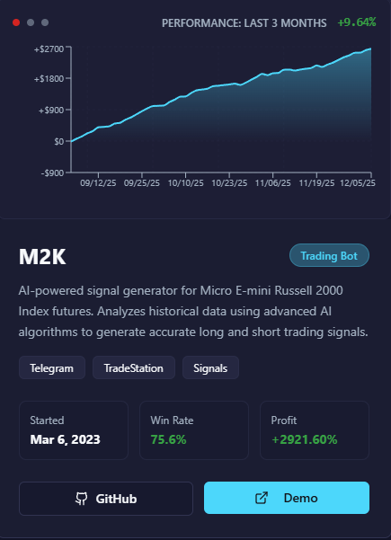
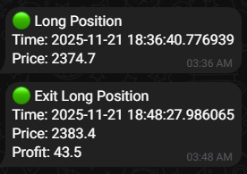
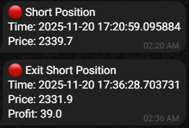
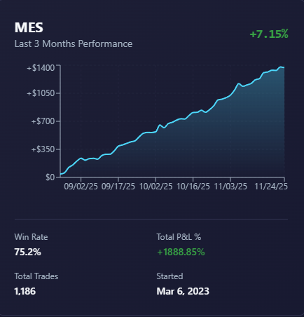
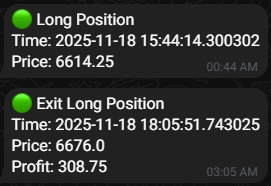
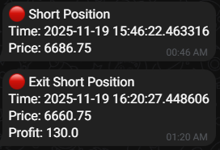

# M2K, MES & MNQ AI Future Trading Bots

## 🤖 AI-Powered Trading Signals for Futures Markets

Welcome to our suite of AI-driven trading bots designed for futures markets. Our bots generate precise open and exit signals for long and short positions, helping traders make informed decisions in the fast-paced world of futures trading.

---

🌐 Platform: https://future-trading-omega.vercel.app \
✉ Telegram Channel: https://t.me/m2k_trading

## 📊 Trading Bots Overview

### M2K Bot - Micro E-mini Russell 2000 Index Futures

The **M2K Bot** is an AI-powered trading system specifically designed for Micro E-mini Russell 2000 Index futures contracts. This bot analyzes market patterns and generates automated long and short entry signals, along with precise exit recommendations to help traders capitalize on Russell 2000 index movements. It's perfect for traders who want systematic, data-driven signals for the small-cap index futures market.

### MES Bot - Micro E-mini S&P 500 Futures

The **MES Bot** focuses on Micro E-mini S&P 500 futures, providing intelligent trading signals for one of the most liquid futures markets in the world. This AI bot monitors S&P 500 market dynamics and delivers timely entry and exit signals for both long and short positions, enabling traders to navigate the broad market index with confidence. It's ideal for traders seeking automated signal generation for the benchmark U.S. stock market index.

### MNQ Bot - Micro E-mini Nasdaq-100 Futures

The **MNQ Bot** specializes in Micro E-mini Nasdaq-100 futures, offering AI-generated trading signals for the tech-heavy Nasdaq-100 index. This bot leverages advanced algorithms to identify optimal entry and exit points for long and short trades, helping traders capture opportunities in the technology and growth-oriented sectors. It's designed for traders who want systematic signal generation for the high-volatility Nasdaq futures market.

---

## 📈 Performance Charts & Signal Examples

### M2K Bot - Performance & Signals

<table style="width:100%; border-collapse: collapse;">
<tr>
<td style="width:50%; padding:10px; vertical-align:top; border:1px solid #ddd;">

**Performance Chart**

*M2K Bot performance chart showing account balance and trading results over time.*

</td>
<td style="width:50%; padding:10px; vertical-align:top; border:1px solid #ddd;">

**Trading Signals**

**Long Signal:**

*Example M2K long entry and exit signals with green markers.*

**Short Signal:**

*Example M2K short entry and exit signals with red markers.*

</td>
</tr>
</table>

---

### MES Bot - Performance & Signals

<table style="width:100%; border-collapse: collapse;">
<tr>
<td style="width:50%; padding:10px; vertical-align:top; border:1px solid #ddd;">

**Performance Chart**

*MES Bot performance chart displaying cumulative performance and trade statistics.*

</td>
<td style="width:50%; padding:10px; vertical-align:top; border:1px solid #ddd;">

**Trading Signals**

**Long Signal:**

*Example MES long entry and exit signals showing optimal entry points.*

**Short Signal:**

*Example MES short entry and exit signals for downward market movements.*

</td>
</tr>
</table>

---

### MNQ Bot - Performance & Signals

<table style="width:100%; border-collapse: collapse;">
<tr>
<td style="width:50%; padding:10px; vertical-align:top; border:1px solid #ddd; text-align: center;">
Comming soon!

<!-- **Performance Chart** -->

<!--  -->

<!-- *MNQ Bot performance chart illustrating account growth and trading metrics.* -->

</td>
<!-- <td style="width:50%; padding:10px; vertical-align:top; border:1px solid #ddd;"> -->

<!-- **Trading Signals** -->

<!-- **Long Signal:** -->
<!--  -->

<!-- *Example MNQ long entry and exit signals for bullish market conditions.* -->

<!-- **Short Signal:** -->
<!--  -->

<!-- *Example MNQ short entry and exit signals for bearish market conditions.* -->

<!-- </td> -->
</tr>
</table>

---

## 🎯 What You Get with These Bots

### ✅ **Precise Entry Signals**
- AI-generated long and short entry signals based on advanced market analysis
- Real-time signal delivery when trading opportunities arise
- Clear signal indicators that tell you exactly when to enter the market

### ✅ **Smart Exit Signals**
- Automated exit recommendations to help lock in profits and limit losses
- Optimal exit timing based on market conditions and risk management
- Signals that adapt to changing market dynamics

### ✅ **Multi-Index Coverage**
- Access to signals for three major futures markets (M2K, MES, MNQ)
- Diversification across different market segments
- Flexible trading across small-cap, large-cap, and tech-focused indices

### ✅ **Time Efficiency**
- Save hours of market analysis and chart reading
- Get instant signal notifications so you never miss an opportunity
- Focus on execution while the AI handles the analysis

### ✅ **Systematic Trading Approach**
- Consistent, rule-based signal generation
- Remove emotional decision-making from your trading
- Backed by data-driven algorithms and market analysis

### ✅ **Performance Tracking**
- Visual performance charts for each bot
- Track the effectiveness of signals over time
- Monitor your trading results and optimize your strategy

---

## 📞 Contact Information

### Get Started Today

For questions, support, or to learn more about our AI Future Trading Bots:

- **Email**: tinytotos99@gmail.com
- Discord Username: tinytotos99
- [Discord Channel](https://discord.gg/dKzRbqRXdJ)
- [GitHub](https://github.com/tinytotos99)

---

## ⚠️ Risk Disclaimer

Trading futures contracts involves substantial risk of loss and may not be suitable for all investors. Past performance is not indicative of future results. These trading bots provide signals for informational purposes only and should be used as part of a comprehensive trading strategy. Always conduct your own research and trade responsibly within your risk tolerance.

---

*Automate your futures trading with AI-powered precision.*

